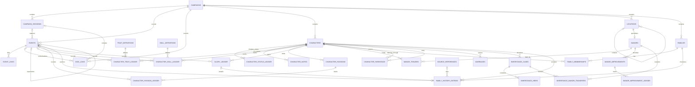

# Foundation ER diagram

```mermaid
erDiagram
    CAMPAIGNS ||--o{ CAMPAIGN_SESSIONS : contains
    CAMPAIGNS ||--o{ EVENTS : records
    CAMPAIGN_SESSIONS o|--o{ EVENTS : captures
    EVENTS ||--o{ EVENT_LINKS : links
    CAMPAIGNS ||--o{ DICE_LOGS : records
    CAMPAIGN_SESSIONS o|--o{ DICE_LOGS : includes
    EVENTS o|--o{ DICE_LOGS : contextualizes
    EVENTS o|--o{ EVENTS : supersedes
    EVENTS o|--o{ CHARACTER_TRAIT_LEDGER : records
    EVENTS o|--o{ CHARACTER_SKILL_LEDGER : records
    EVENTS o|--o{ CHARACTER_PASSION_LEDGER : records
    EVENTS o|--o{ GLORY_LEDGER : records
    CAMPAIGNS ||--o{ CHARACTERS : contains
    CHARACTERS ||--o{ CHARACTER_STATUS_LEDGER : changes_status
    CHARACTERS ||--o{ CHARACTER_NOTES : documents
    CHARACTERS ||--o{ CHARACTER_TRAIT_LEDGER : tracks
    TRAIT_DEFINITIONS ||--o{ CHARACTER_TRAIT_LEDGER : defines
    CHARACTERS ||--o{ CHARACTER_SKILL_LEDGER : tracks
    SKILL_DEFINITIONS ||--o{ CHARACTER_SKILL_LEDGER : defines
    CHARACTERS ||--o{ CHARACTER_PASSIONS : holds
    CHARACTER_PASSIONS ||--o{ CHARACTER_PASSION_LEDGER : tracks
    CHARACTERS ||--o{ GLORY_LEDGER : earns
    CAMPAIGNS ||--o{ LOCATIONS : contains
    LOCATIONS o|--o{ LOCATIONS : contains
    LOCATIONS ||--o| MANORS : specializes
    MANORS ||--o{ MANOR_TENURES : held_by
    CHARACTERS ||--o{ MANOR_TENURES : holds
    MANORS ||--o{ MANOR_IMPROVEMENTS : develops
    MANOR_IMPROVEMENTS ||--o{ MANOR_IMPROVEMENT_LEDGER : tracks
    CAMPAIGNS ||--o{ FAMILIES : contains
    FAMILIES ||--o{ FAMILY_MEMBERSHIPS : has
    CHARACTERS ||--o{ FAMILY_MEMBERSHIPS : belongs_through
    CHARACTERS ||--o{ CHARACTER_PARENTAGE : parent
    CHARACTERS ||--o{ CHARACTER_PARENTAGE : child
    CHARACTERS ||--o{ MARRIAGES : spouse
    CHARACTERS ||--o{ INHERITANCE_CASES : decedent
    INHERITANCE_CASES ||--o{ INHERITANCE_HEIRS : considers
    INHERITANCE_CASES ||--o{ INHERITANCE_MANOR_TRANSFERS : resolves
    MANORS ||--o{ INHERITANCE_MANOR_TRANSFERS : transfers
    FAMILIES ||--o{ FAMILY_HISTORY_ENTRIES : chronicles
    EVENTS ||--o| FAMILY_HISTORY_ENTRIES : anchors
    SOURCE_REFERENCES o|--o{ FAMILY_HISTORY_ENTRIES : cites
    CHARACTERS o|--o{ FAMILY_HISTORY_ENTRIES : ancestor
    GLORY_LEDGER o|--o| FAMILY_HISTORY_ENTRIES : awards
```
